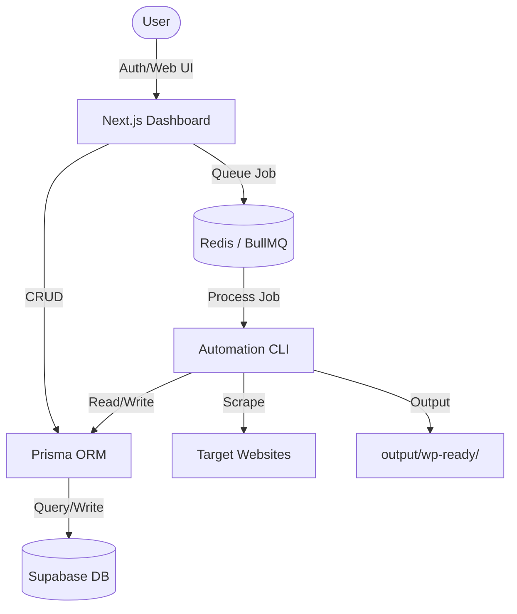

# Architecture Documentation

## System Architecture

The project has transitioned to a **Hybrid Platform Architecture**, combining the high-performance execution of a Node.js CLI with the accessibility and observability of a modern web application.

### 1. Management & UI Layer (`src/app/`, `src/components/`)
A **Next.js 16** web dashboard serves as the primary interface for users to:
- Authenticate via **Supabase Auth**.
- Manage "Site Profiles" (configurations for specific dealerships).
- Trigger and monitor automation runs in real-time.
- View metrics and logs.

### 2. Persistence Layer (`prisma/`, `src/lib/db/`)
All application state is persisted in a **Supabase PostgreSQL** database.
- **Prisma ORM**: Used for type-safe database access and schema migrations.
- **Models**: Includes SiteProfiles, Runs, Metrics, and Auth users.

### 3. Execution & Orchestration Layer (`src/cli/`, `src/core/`)
The original CLI core handles the heavy-duty automation:
- **Automation Pipeline**: Triggered either manually via terminal or as an async job from the web UI.
- **Service Layer**: Scraper, Processor, Image Downloader, and CSV Generator services operate as specialized modules within the pipeline.

### 4. Async Job Layer (New)
- **BullMQ / Redis**: Used to offload long-running scraping tasks from the web server thread. Redis acts as the message broker for job queueing and state tracking.

## Data Flow Diagram

## Resiliency Patterns
- **Retries**: All network requests (scraping and image downloads) use a centralized retry wrapper in `utils/errors.js`.
- **Concurrency Management**: Concurrency limits are applied to scraping and image downloading to prevent rate-limiting and local resource exhaustion.
- **Stateless Services**: Services are generally stateless, relying on the filesystem and configuration for persistence.

## Configuration Strategy
The application uses a **Singleton Config** pattern. Configuration is loaded from `.env` files and merged with internal defaults. This ensures that every service has a consistent "view" of settings like `dealer_slug`, `output_dir`, and timeouts.
