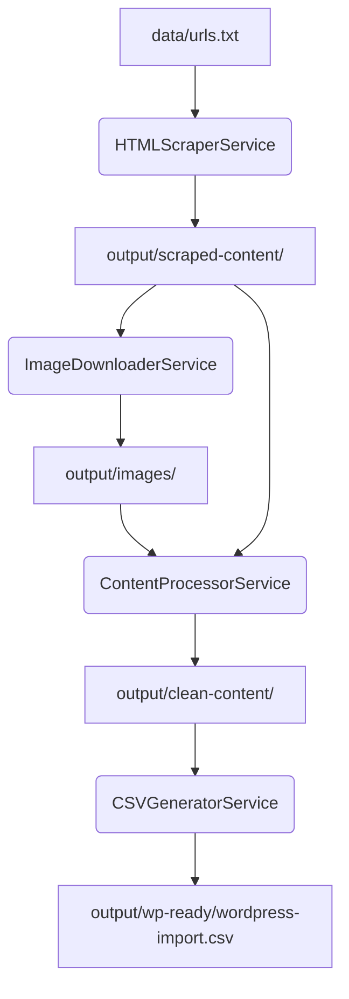

# Architecture Documentation

## System Architecture

The project follows a **Service-Oriented Layered Architecture**, where each major stage of the content automation pipeline is encapsulated in a dedicated service. This separation of concerns allows for robust error handling, retries, and modular development.

### 1. Orchestration Layer (`src/cli/`)
The `automation.js` controller manages the lifecycle of a scraping run. It initializes services, passes data between them, and ensures the pipeline completes successfully or fails gracefully.

### 2. Service Layer (`src/core/`)
- **HTMLScraperService**: Operates at the network/browser level. Responsible for fetching raw HTML. It includes logic for Cloudflare bypass, URL validation, and automated filename generation.
- **ImageDownloaderService**: An auxiliary service that handles binary assets. It downloads images synchronously or concurrently and maintains a mapping between original URLs and local filenames.
- **ContentProcessorService**: The most complex service. It uses JSDOM to parse HTML and applies a series of transformations:
  - **Selector Filtering**: Removes unwanted elements (headers, footers, forms, scripts).
  - **Class/ID Sanitization**: Strips most styling attributes but preserves a whitelist of Bootstrap layout classes (e.g., `col-md-6`, `row`).
  - **Path Normalization**: Re-paths internal links and image `src` attributes to match the target WordPress environment.
- **CSVGeneratorService**: Transforms the final processed JSON/HTML data into a structured CSV format compatible with WordPress import plugins.

### 3. Support Layer (`src/utils/`)
Provides shared logic for filesystem operations, custom error classes, and resilient retry mechanisms used across all services.

## Data Flow Diagram

## Resiliency Patterns
- **Retries**: All network requests (scraping and image downloads) use a centralized retry wrapper in `utils/errors.js`.
- **Concurrency Management**: Concurrency limits are applied to scraping and image downloading to prevent rate-limiting and local resource exhaustion.
- **Stateless Services**: Services are generally stateless, relying on the filesystem and configuration for persistence.

## Configuration Strategy
The application uses a **Singleton Config** pattern. Configuration is loaded from `.env` files and merged with internal defaults. This ensures that every service has a consistent "view" of settings like `dealer_slug`, `output_dir`, and timeouts.
